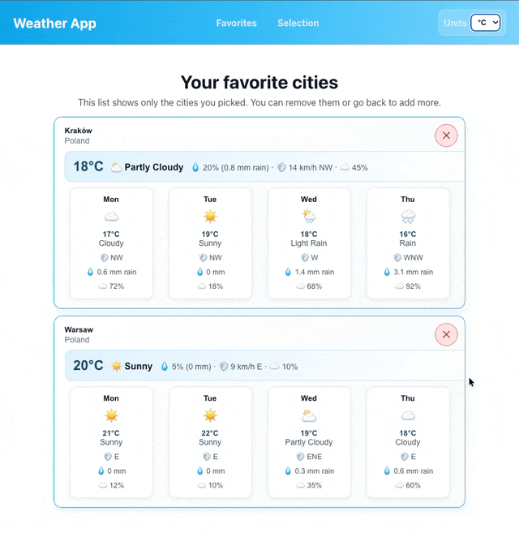

# Web Weather App



## Instrukcja uruchomienia projektu

### Wersja produkcyjna (Docker Compose)

1. Zbuduj i uruchom kontenery:
   ```bash
   docker compose up --build
   ```
2. Aplikacja frontend będzie dostępna pod adresem:
   `http://localhost:3000`
3. API działa pod adresem:
   `http://localhost:8080/api/health`

### Wersja developerska (lokalnie)

1. Uruchom bazę danych i API:
   ```bash
   docker compose up db api
   ```
2. W osobnym terminalu uruchom frontend:
   ```bash
   npm install
   npm run dev
   ```
3. Frontend będzie dostępny pod adresem:
   `http://localhost:3000`

### CI/CD

- Pull requesty do `main`: lint + build.
- Push do `main`: lint + build + budowa i publikacja obrazu do GHCR.
